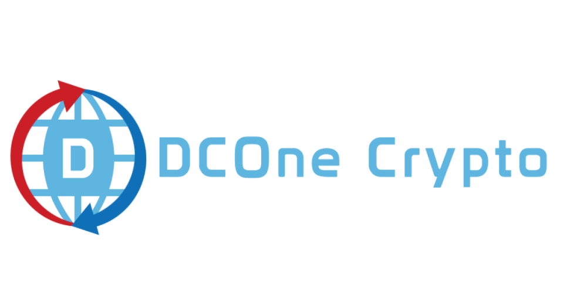
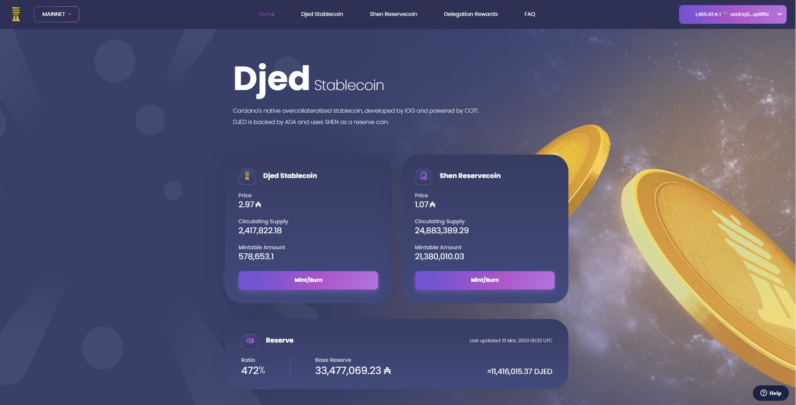
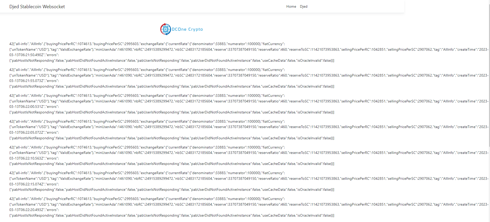

<h1 align="center">

Djed Stablecoin Websocket Data

</h1>

### Websocket will get data including:

### 1. Djed Stablecoin
- Price
- Circulating Supply
- Mintable Amount

### 2. Shen Reservecoin
- Price
- Circulating Supply
- Mintable Amount

### 3.Reserve
- Ratio
- Base Reserve
- Last updated

